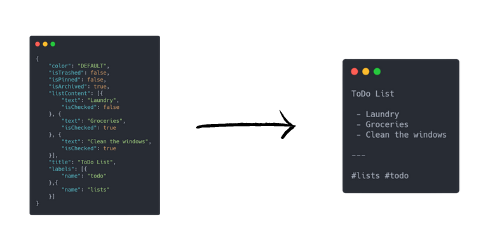

# GoogleKeepJSONToText

A Python script to convert Google Keep's JSON files to plain text TXT





# How it works

This script will create a copy of each note using the [JSON file](docs/note_sample.json) from  [Google TakeOut](https://takeout.google.com/) as a basis.

    (Keep in mind that this script was designed to work with Google Keep's JSON document structure of December 2020, that being said, in theory it should work without major interrupts with any version, considering that the basic JSON structed tends not to change)

All information dubbed as unnecessary is skipped, and only the main content is copied to the final file. The later result can be imported in applications such as [Trello](https://trello.com/), [Evernote](https://evernote.com/) and [Notion](https://notion.son/) without the excessive bloat from either the Google Takeout HTML file or the machine-readable-only JSON.

This script completely ignores Google Keep attachments and images. The exported files will, naturally, contain only text.


# How to use


1. Download the python script ```run.py``` 
2. Go to [Google TakeOut](https://takeout.google.com/) select and download the Google Keep Archive (This archive contains both HTML and JSON version of your notes)
3. Unzip the _Google Keep Archive_ and copy the ```run.py``` to the folder named ```Takeout```
    - You can also place the script alongside the JSON files directly 
4. Run the script

The script will create a subfolder inside ```Takeout/Keep/``` containing the TXT versions of each processable JSON file.

# Roadmap

I do not plan to maintain active development of this script since it was designed as a one time solution to handle Google Keep's files. But feel free to fork, comment or open any issue if you would like to ask for help or contribute.


# License

_This Software Is Open Source andIs Provided "as Is", Without Warranty of Any Kind, Express or
Implied, Including but Not Limited to the Warranties of Merchantability,
Fitness for a Particular Purpose and Noninfringement._ See, [License](LICENSE)